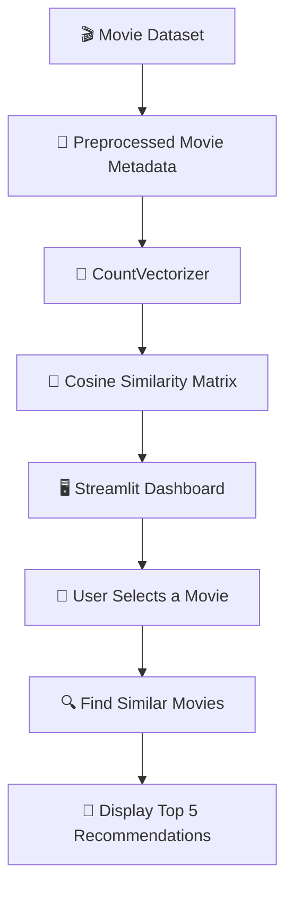

# 🎬 MovieMatch — Movie Recommendation System

<p align="center">
  
  
  
  
  
</p>

<p align="center">
  <b>🍿 Discover movies you'll love, powered by content-based filtering!</b>
</p>

---

## 📌 About the Project

**MovieMatch** is an interactive movie recommendation system developed using Python and Streamlit. It recommends movies similar to a user's selected film by using preprocessed movie metadata and cosine similarity scores.

The system uses text-based features such as **genres, keywords, movie overviews, cast, and directors** to identify similar movies and display the top five recommendations through a simple web dashboard.

🎯 **Goal:** Make movie discovery smarter, faster, and more enjoyable with machine learning.

## ✨ Key Features

| Feature                  | Description                                                  |
| ------------------------ | ------------------------------------------------------------ |
| 🎥 Movie Selection       | Select a movie from the available dataset.                   |
| 🤖 Smart Recommendations | Discover five similar movies based on content similarity.    |
| 🧠 Text Vectorization    | Represent movie metadata using CountVectorizer.              |
| 📐 Cosine Similarity     | Compare movie feature vectors to identify similar content.   |
| ⚡ Fast Results           | Retrieve recommendations from precomputed similarity scores. |
| 🖥️ Interactive UI       | Explore recommendations through a Streamlit dashboard.       |
| 📦 Preprocessed Data     | Load saved movie data and similarity scores using Pickle.    |

## 🛠️ Tech Stack

<p>
  
  
  
  
</p>

| Technology               | Purpose                                                  |
| ------------------------ | -------------------------------------------------------- |
| 🐍 **Python**            | Core programming and recommendation logic                |
| 🌐 **Streamlit**         | Building the interactive web application                 |
| 🐼 **Pandas**            | Loading and manipulating movie data                      |
| 🧮 **CountVectorizer**   | Converting textual movie metadata into numerical vectors |
| 📏 **Cosine Similarity** | Measuring similarity between movies                      |
| 📂 **Pickle**            | Loading preprocessed data and saved similarity scores    |

## ⚙️ How It Works



### 🔍 Recommendation Process

1. **Load Data:** Read the prepared movie dataset from `movies_dict.pkl`.
2. **Extract Features:** Represent movie metadata as numerical text vectors during preprocessing.
3. **Calculate Similarity:** Use cosine similarity scores to compare movies.
4. **Select a Movie:** Let the user choose a movie from the dropdown menu.
5. **Rank Results:** Sort similarity scores and exclude the selected movie itself.
6. **Show Recommendations:** Display the five most similar movies.

## 🖥️ Application Preview

<p align="center">
  
</p>

> 📸 Replace this placeholder with a real screenshot of your running Streamlit application for a stronger GitHub portfolio.

## 📁 Project Structure

```text
MovieMatch/
│
├── 📄 app.py
├── 📦 movies_dict.pkl
├── 📊 similarity.pkl
├── 📄 requirements.txt
└── 📘 README.md
```

| File               | Description                                            |
| ------------------ | ------------------------------------------------------ |
| `app.py`           | Main Streamlit application and recommendation function |
| `movies_dict.pkl`  | Serialized movie dataset                               |
| `similarity.pkl`   | Precomputed movie similarity matrix                    |
| `requirements.txt` | Python package dependencies                            |
| `README.md`        | Project documentation                                  |

## 🚀 Getting Started

Follow these steps to run MovieMatch on your local machine.

### 1️⃣ Clone the Repository

```bash
git clone https://github.com/nodanbhatia/MovieMatch.git
cd MovieMatch
```

> Replace the repository URL if your actual GitHub repository has a different name.

### 2️⃣ Create a Virtual Environment (Recommended)

```bash
python -m venv venv
```

**Windows:**

```bash
venv\Scripts\activate
```

### 3️⃣ Install Dependencies

Create a `requirements.txt` file:

```text
streamlit
pandas
scikit-learn
```

Install the packages:

```bash
pip install -r requirements.txt
```

### 4️⃣ Run the Application

```bash
streamlit run app.py
```

Open the local URL displayed in your terminal, usually:

**http://localhost:8501**

## 📦 Required Dataset Files

Before running the application, ensure these files are present in the same directory as `app.py`:

* `movies_dict.pkl`
* `similarity.pkl`

⚠️ These files must contain compatible movie data and similarity scores. If they are missing, the application will not be able to generate recommendations.

## 🎯 Example Use Case

Imagine you enjoy a particular action movie.

1. 🎬 Select the movie from the dropdown.
2. 🖱️ Click **Recommend**.
3. 🤖 MovieMatch checks its similarity scores.
4. 🍿 Explore five movies with similar content.

The recommendations depend on the movie metadata and similarity matrix used by the system.

## 🔮 Future Enhancements

* 🖼️ Movie posters and visual recommendation cards
* ⭐ Similarity percentages and relevance indicators
* 🔎 Searchable movie selection
* 🎭 Genre, cast, and director filters
* 📖 Movie descriptions and release-year information
* 🌐 Public deployment using Streamlit Community Cloud
* 🧪 Recommendation quality evaluation

*These are planned enhancements and may not be implemented in the current version.*

## 🧠 Concepts Demonstrated

* Content-based recommendation systems
* Text feature extraction
* CountVectorizer and cosine similarity
* Similarity ranking using Python
* Data manipulation with Pandas
* Interactive application development with Streamlit
* Loading serialized machine learning data

## 👨‍💻 Developer

<p align="center">
  <b>Nodan Bhatia</b><br/>
  Aspiring AI Engineer | Data Science & Machine Learning
  <br/><br/>
  <a href="https://github.com/nodanbhatia">
    
  </a>
</p>

## ⭐ Support

If you find this project useful for learning about recommendation systems, consider giving the repository a ⭐ on GitHub!

---

<p align="center">
  <b>🎬 MovieMatch — Find your next favorite movie!</b>
  <br/>
  Made with ❤️ using Python and Streamlit.
</p>
